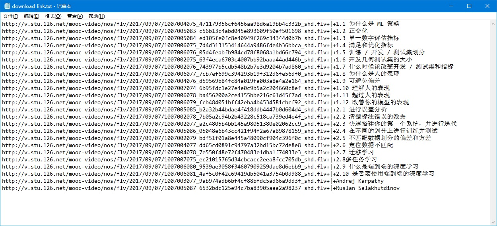

#Emm, it doesn't work now. 2018.09.06
-----
## Usage

### step 1

copy the link of the course that you want to learn


### step 2

paste the link in the box on site :[http://tools.antlm.com/](http://tools.antlm.com/) 


then click the button beside the box.

### step 3

click the button "一键复制高清视频地址".


and now, you have got download link in your clipboard.

### setp 4

press `ctrl` and `V` after open the file "download_link.txt", then you will see this



and save it.

### step 5

double click `Downloader.exe`, it will show this:


All videos will be saved into folder `src`.

## For linux
you need a g++ compiler and `aria2`
### For Debian/Ubuntu
```bash
sudo apt-get update
sudo apt-get install aria2
```

## Attention
You need the aria2c downloader. This repository is just a string transfer.
You can compile the main.cpp with -std=c++11 by yourself.
